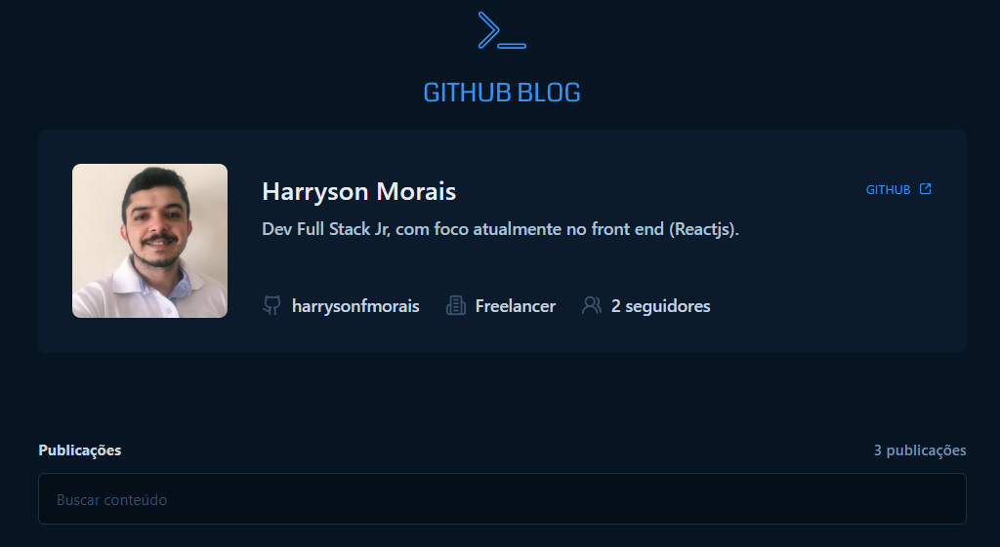

# Desafio 03 - Github Blog

Nesse desafio, será desenvolvido uma aplicação que utilizará a API do GitHub para buscar issues de um repositório, dados do seu perfil e exibir elas como um blog.

- Listagem do seu perfil com imagem, número de seguidores, nome e outras informações disponíveis pela API do GitHub.
- Listar e filtrar todas as issues do repositório com um pequeno resumo do conteúdo dela
- Criar uma página para exibir um post (issue) completo